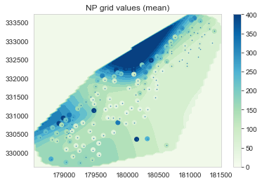
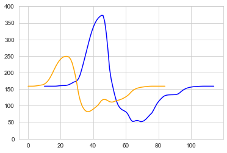

Quick test of Neural Processes vs Kriging (Gaussian Processes). 

The results look promising in terms of gridding fit. You can likely get a good result with a better scalability than Kriging (O(x+y) vs O((x+y)^3)) *.

However, it does show some neural network like behviour: where it extrapolates at the edges instead of returning to the mean. It does not extrapolate outside of the min and max of the context input data however.

\* Note that scaling is not that simple. This uses [attentive neural processes](https://arxiv.org/pdf/1901.05761.pdf) that have scalability of O(x(x+y)). And it's possible to use Kriging methods that reduce the scalability [to O(x^2) or similar](https://arxiv.org/abs/1809.11165).

# Results 

Results on test set. In this case the inputs are x and y, the output is lead.

We can see the the Attentive Neural Process got a mean absolute error of 55.9 which is better than Kriging 62.5 and the Nearest Neighbour baseline at 66.1.

Kriging:

Neural Processes:

Map with NP grid

# Extra features

If we give the NP extra features it can produce a nice grid. This mainly shows it can learn to follow elevation and produce more complex grids, given more features. See ./using_extra_features.ipynb

We can also reduce the mean absolute error to 20.

# Extrapolation

Here are some profile line to demonstrate the different way that Kriging and NP extrapolate beyond know data. Kriging will return to mean, while NP will extrapolate within the min and max of the context data (50-400)

Which behaviour is more desirable? It depends on the problem but in this case the lead seems to come from the river that surrounds the samples areas to the N, S, and West, so the NP extrapolating to high levels at these boundaries seems valid.

# Data 
For data I used the lead soil samples from the [meuse dataset](http://spatial-analyst.net/book/meusegrids). 

> The meuse is a classical geostatistical data set used frequently by the creator of the gstat package to demonstrate various geostatistical analysis steps. The point data set consists of 155 samples of top soil heavy metal concentrations (ppm), along with a number of soil and landscape variables. The samples were collected in a flood plain of the river Meuse, near the village Stein. 

# See also

- Testing Neural Process/ Attentive/ Recursive on a timeseries https://github.com/3springs/attentive-neural-processes
- Testing convcnp on timeseries https://github.com/3springs/convcnp
- Neural Process Paper: https://arxiv.org/abs/1807.01622
- Attentive Neural Process Paper: https://arxiv.org/abs/1901.05761

# Details

- author: Michael Clark
- date: 2020 03 02
- License: MIT
- url: https://github.com/3springs/np_vs_kriging
