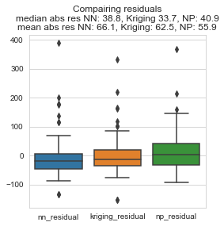

Quick test of Neural Processes vs Kriging (Gaussian Processes). 

The results look promising in terms of gridding fit. You can likely get a good result with a better scalability than Kriging (O(x) vs O($x^3$)). 

However, it does show some neural network like behviour: where it extrapolates at the edges instead of returning to the mean. It does not extrapolate outside of the min and max of the context input data however.

# Results 

Results on test set:

Kriging:

Neural Processes:

Map with NP grid

# Data 
For data I used the lead soil samples from the [meuse dataset](http://spatial-analyst.net/book/meusegrids). 

> The meuse is a classical geostatistical data set used frequently by the creator of the gstat package to demonstrate various geostatistical analysis steps. The point data set consists of 155 samples of top soil heavy metal concentrations (ppm), along with a number of soil and landscape variables. The samples were collected in a flood plain of the river Meuse, near the village Stein. This zip files contains additional gridded maps (2-40 m resolution), which are used in the exercise 'First steps'.

